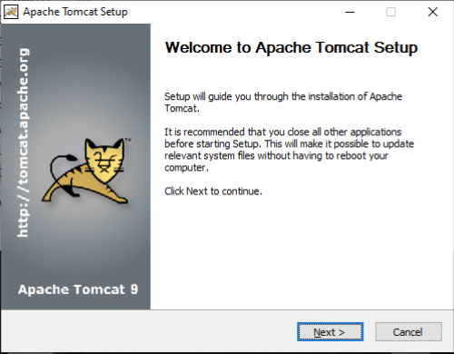
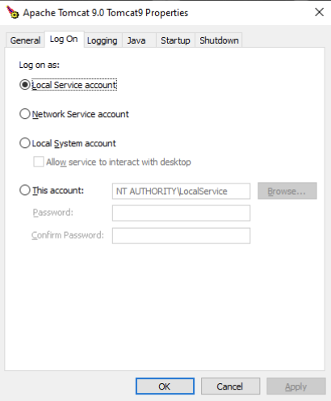

# Tomcat - Installation

--

## Intallationsschritte
- JDK installieren und <span style="color:mediumpurple">JAVA_HOME</style> setzen
- Binärdistribution (https://tomcat.apache.org/download-90.cgi#9.0.96) herunterladen und auspacken, z.B. in ein Verzeichnis <span style="color:mediumpurple"> apache-tomcat-9.0.9</span> <br>
- Die Umgebungsvariable <span style="color:mediumpurple">CATALINA_HOME</span> auf dieses Verzeichnis setzen (erforderlich). Sie zeigt auf den Start-Ordner der Binärdistribution. 
- Das Tomcat Startup-Skript kann diese Variable auch automatisch setzen, wenn sie nicht gesetzt ist.
- Optional: <span style="color:mediumpurple">CATALINA_BASE</span> wird genutzt um die Konfiguration und die Webapps zu trennen und zeigt auf die aktive Konfiguration.

--

## Verzeichnis Struktur

```plaintext
${CATALINA_HOME}
│
├── bin/
│   └── Skripte und Bootstrap
├── conf/
│   ├── catalina.policy
│   ├── catalina.properties
│   ├── context.xml
│   ├── server.xml
│   ├── tomcat-users.xml
│   └── web.xml
├── lib/
│   └── JAR-Dateien
├── logs/
│   ├── catalina.out
│   ├── localhost_access_log.txt
│   └── weitere Logdateien
├── temp/
│   └── temporäre Dateien
├── webapps/
│   ├── docs/
│   ├── examples/
│   ├── host-manager/
│   ├── manager/
│   ├── ROOT/
│   └── weitere Webanwendungen
└── work/
    └── kompilierte JSP-Dateien und temporäre Arbeitsdateien
```
<!-- .element: class="r-stretch" -->


</div>

--

## JDK vs JRE
- Tomcat benötigt <span style="color:mediumpurple">JAVA_HOME</span> für das JDK oder <span style="color:mediumpurple">JRE_HOME</span> für das JRE.
- Ein JDK enthält auch Entwicklungs-Tools, die nicht im JRE enthalten sind.
- JDK ist erforderlich für Entwicklung und wenn JSP benutzt werden
- JRE ist in Produktion ausreichend, wenn JSP vorkompiliert werden.

--

## Umgebungs-Variablen

Das Skript <span style="color: mediumpurple">`bin/setenv`</span> definiert Umgebungsvariablen(außer CATALINA_HOME und CATLINA_BASE):

| JAVA_HOME     | Zeigt auf das Installations-Verzeichnis des JDK. Wird nur für Entwicklung oder JSP benötigt         |
| -- |-----------------------------------------------------------------------------------------------------|
| JRE_HOME      | Zeigt auf die JRE Installation. Muss gesetzt sein wenn JAVA_HOME nicht benutzt wird                 |
| CATALINA_HOME | Zeigt auf das Tomcat Installations-Verzeichnis. Kann vom Start-Skript automatisch ermittelt werden. |
| CATALINA_BASE | Optional: Zeigt auf ein abweichendes Konfigurations-Verzeichnis                                     |
| CATALINA_OPTS | Optional: Java-Optionen für Tomcat, z.B. Memory-Settings                                            |
| JAVA_OPTS     | Optional: Java-Optionen für alle Java-Anwendungen, auch Start- & Stop-Sripte                        |
| CATALINA_PID  | Optional: Nur Unix - Datei mit der Prozess-ID von Tomcat                                            |


--

## Tomcat Starten

Unix:
   
```
    $CATALINA_HOME/bin/startup.sh
    
    oder
    
    $CATALINA_HOME/bin/catalina.sh start
```

<br>
<br>
Windows:

```
    %CATALINA_HOM%\bin\startup.cmd
    
    oder
    
    %CATALINA_HOME%\bin\catalina.cmd start
```

<br>
<br>

Nach dem Start ist Tomcat unter http://localhost:8080 erreichbar.

--

## Tomcat Stoppen

Unix:

    $CATALINA_HOME/bin/shutdown.sh

    oder

    $CATALINA_HOME/bin/catalina.sh stop

<br>
<br>
Windows:

    %CATALINA_HOM%\bin\startup.cmd

    oder

    %CATALINA_HOME%\bin\catalina.cmd stop


--

## Catalina Kommandos

Das Skript `catalina.sh` (oder `catalina.bat`) unterstützt folgende Kommandos:
<br>

| start               | Startet Tomcat im Hintergrund.<br>  Konsolenausgaben werden in die Logdatei<br> `logs/catalina.out` geschrieben. |
| --------------------| -- |
| run                 | Startet Tomcat in der Konsole. <br>Konsolenausgaben werden in der Konsole angezeigt. |
| stop \<n> \<-force> | Stoppt Tomcat.<br>Optional: Wartet n Sekunden.<br>Optional: Mit -force wird SIGKILL benutzt, falls erforderlich.|
| configtest    | Prüft die Konfiguration. |
| version       | Zeigt die Version. |
| debug         | Startet im Debug-Modus im Vordergrund <br>(für Java IDE's mit JPDA Support) |
| jpda start    | Startet Service im Debug-Modus im Hintergrund |


--

## Windows-Service
Windows-Installer (.exe) installiert Tomcat als Windows-Service.<br>
Eigenschaften des Windows-Services über System-Tray.
<div class="r-stack" >






</div>

--


# Linux Installation

--

## User erstellen
Tomcat sollte nicht als root laufen. Ein eigener Benutzer ist empfohlen.

```bash

sudo useradd -r -m -U -d /opt/tomcat -s /bin/false tomcat


```
> 1. sudo: Führt den Befehl mit Superuser-Rechten aus.
> 2. useradd: Erstellt einen neuen Benutzer.
> 3. -r: Erstellt einen Systembenutzer, der für Dienste gedacht ist. UID kleiner 1000. 
> 4. -m: Erstellt ein Home-Verzeichnis für den Benutzer. 
> 5. -U: Erstellt eine Gruppe mit dem gleichen Namen wie der Benutzer. 
> 6. -d /opt/tomcat: Setzt das Home-Verzeichnis auf /opt/tomcat. 
> 7. -s /bin/false: Setzt Login-Shell. Verhindert die Anmeldung des Benutzers. 
> 8. tomcat: Name des Benutzers.

--

## Installations-Paket laden
Voraussetzung ist ein installiertes JDK. Tomcat kann direkt von der Apache-Website heruntergeladen und ausgepackt werden.

```bash

  curl -O https://downloads.apache.org/tomcat/tomcat-9/v9.0.96/bin/apache-tomcat-9.0.96.tar.gz
  
  sudo tar xf apache-tomcat-9.0.96.tar.gz  -C /opt/tomcat/

  sudo ln -s /opt/tomcat/apache-tomcat-9.0.96 /opt/tomcat/current

  sudo chown -R tomcat: /opt/tomcat
  sudo sh -c 'chmod +x /opt/tomcat/current/bin/*.sh'
  
 ```

> 1. Auspacken in das zuvor angelegte Home-Verzeichnis
> 2. Einen Link auf das aktuelle Verzeichnis erstellen
> 3. Berechtigungen setzen
> 4. Ausführungsrechte setzen

--

## Environment konfigurieren
setenv.sh erstellen und Umgebungsvariablen setzen. 

```bash

sudo vi /opt/tomcat/current/bin/setenv.sh

chmod u+x /opt/tomcat/current/bin/setenv.sh


```

Umgebungsvariablen setzen:

```bash
#!/bin/sh
JAVA_HOME=/usr/lib/jvm/java-11-openjdk-amd64
CATALINA_PID=/opt/tomcat/current/temp/tomcat.pid
CATALINA_HOME=/opt/tomcat/current
CATALINA_BASE=/opt/tomcat/current
CATALINA_OPTS="-Xms512M -Xmx1024M -server -XX:+UseParallelGC"
JAVA_OPTS=-Djava.awt.headless=true


```

1. JAVA_HOME: Pfad zur Java-Installation
2. CATALINA_PID: Datei mit der Prozess-ID.
3. CATALINA_HOME: Verzeichnis der Tomcat-Installation
4. CATALINA_BASE: Verzeichnis der Konfiguration. Optional.
5. CATALINA_OPTS: Java-Optionen für Tomcat:
   - -Xms512M: Start-Heap-Größe
   - -Xmx1024M: Max-Heap-Größe
   - -server: Server-Modus
   - -XX:+UseParallelGC: Garbage-Collector
6. JAVA_OPTS: Java-Optionen für alle Java-Anwendungen
   - -Djava.awt.headless=true: Headless-Modus für Java AWT


--

## Tomcat im Vordergrund starten
Started im Vordergrund. Log wird in die Console ausgegeben.
```bash

sudo -u tomcat /opt/tomcat/current/bin/catlina.sh run


```

> Immer `sudo -u tomcat` verwenden, um den Service als Benutzer `tomcat` zu starten. Wenn der Service mit root gestartet wird, werden die temporäre Dateien mit root-Rechten erstellt und können nicht von `tomcat` gelesen oder geschrieben werden. Z.B. JSP, Logs, etc.


--

## Service konfigurieren
Tomcat als Service mit `systemd` konfigurieren.

```bash
sudo vi /etc/systemd/system/tomcat.service
```

```plaintext
Description=Apache Tomcat
After=network.target
[Service]
Type=forking
ExecStart=/opt/tomcat/current/bin/startup.sh
ExecStop=/opt/tomcat/current/bin/shutdown.sh
User=tomcat
Group=tomcat
UMask=0007
RestartSec=10
Restart=always
[Install]
WantedBy=multi-user.target
```

1. Description: Beschreibung des Services
2. After: Startet nach dem Netzwerk
3. Type: Forking-Modus. Bedeutet, dass der Service im Hintergrund läuft.
4. ExecStart & ExecStop: Start- und Stop-Skript
6. User & Group: User und Gruppe, unter der der Service läuft
8. UMask: Berechtigungen, die entzogen werden:
   - 0 für den Benutzer und Gruppe: keine Rechte entziehen
   - 7 für alle anderen: entzogen werden Lesen (4), Schreiben (2) und Ausführen (1))
9. RestartSec und Restart: Immer Neustartetn nach Absturz und Wartezeit
10. WantedBy: Nicht-grafische Benutzersitzungen werden akzeptiert.


--

## Service starten

```bash

sudo systemctl daemon-reload

sudo systemctl start tomcat

sudo tail -f /opt/tomcat/current/logs/catalina.out

sudo systemctl stop tomcat

sudo systemctl restart tomcat

```


--

## Tomcat Home

Tomcat Startseite ist unter http://localhost:8080 zu erreichen.


--

## Manager - Status Seite

Tomcat Status-Seite ist unter http://localhost:8080/manager/status zu erreichen.


--

## Manager - List Applications

Die Manager-Applikation ist unter http://localhost:8080/manager/html zu erreichen.


--

## Tomcat Examples

Die Beispiele sind unter http://localhost:8080/examples zu erreichen (falls installiert). 


--

## Server.xml: Ports

```xml
<Server port="8005" shutdown="SHUTDOWN">
  <Service name="Catalina">

    <Connector port="8080" protocol="HTTP/1.1"
               connectionTimeout="20000"
               redirectPort="8443"
               maxParameterCount="1000"
               />

```
- Connectoren legen die Ports fest
- Zum Ändern des Port-Mapping:
  - Shutdown Port anpassen
  - Connector Port anpassen

--

## Server.xml: Ports über Environment setzen

- Property `CATALINA_OPTS` setzen
- EnvironmentPropertySource kann auch alternativ in `conf/common.properties` gesetzt werden

```bash
CATALINA_OPTS="$CATALINA_OPTS -Dorg.apache.tomcat.util.digester.PROPERTY_SOURCE=org.apache.tomcat.util.digester.EnvironmentPropertySource"

ENV_PORT_SHUTDOWN=9105
ENV_PORT_HTTP=9181


```

Umgebungsvariablen in server.xml nutzen:

```xml
<Server port="${ENV_PORT_SHUTDOWN}" shutdown="SHUTDOWN">
  <Service name="Catalina">
    <Connector port="${ENV_PORT_HTTP}" protocol="HTTP/1.1"
```

--

## Mehrere Tomcat-Instanzen
Mehrere Tomcat-Instanzen können auf einem Server laufen. 

- CATALINA_HOME: Binaries
- CATALINA_BASE: Konfiguration und Webapps für mehrere Instanzen

```plaintext
${CATALINA_HOME}
│
├── bin/
│   └── Skripte und Bootstrap
├── lib/
│   └── Standard Bibliotheken
└── endorsed/  (Standard nicht vorhanden)
```
<!-- .element: class="r-stretch" -->


--

## Catalina-Base    

```plaintext
${CATALINA_BASE}
│
├── bin/
│   └── nur setenv.sh
├── conf/
│   ├── catalina.policy
│   ├── catalina.properties
│   ├── context.xml
│   ├── server.xml
│   ├── tomcat-users.xml
│   └── web.xml
├── lib/
│   └── JAR-Dateien, zusätzlich
├── logs/
│   ├── catalina.out
│   ├── localhost_access_log.txt
│   └── weitere Logdateien
├── temp/
│   └── temporäre Dateien
├── webapps/
│   ├── docs/
│   ├── examples/
│   ├── host-manager/
│   ├── manager/
│   ├── ROOT/
│   └── weitere Webanwendungen
└── work/
    └── kompilierte JSP-Dateien und temporäre Arbeitsdateien

```
<!-- .element: class="r-stretch" -->

--

## Multi Instance Setup

```plaintext
/opt/tomcat/current         CATALINA_HOME

/opt/tomcat/home/tomcat1    CATALINA_BASE       Port 8180
/opt/tomcat/home/tomcat2    CATALINA_BASE       Port 8280
/opt/tomcat/home/tomcat2    CATALINA_BASE       Port 8380

```
<!-- .element: class="r-stretch" -->

--

</div>

--