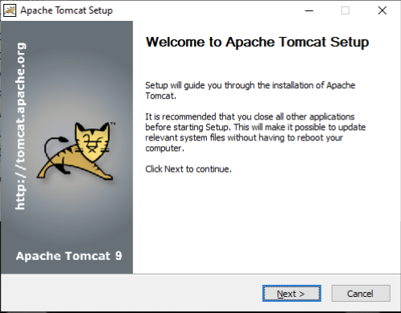
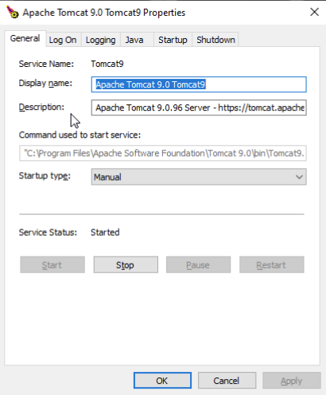

# Tomcat unter Windows installieren

# Tutorial: Installation von Tomcat 9 unter Windows

## Schritt 1: Vorbereitungen
* Java 8 oder Java 11 muss installiert sein.

Prüfen Sie die Java-Version mit dem Befehl `java -version` im Terminal.

# Schritt 2: Tomcat herunterladen

> Ein aktuelles Installations-Paket liegt auf dem Netzlaufwerk bereit.

1. Besuchen Sie die offizielle Tomcat-Website: https://tomcat.apache.org/download-90.cgi
2. Wählen Sie unter "Binary Distributions" das passende Windows-Paket aus:
   * 32-bit/64-bit Windows Service Installer für eine einfache Installation als Windows-Dienst. 
   * ZIP-Version für eine manuelle Installation.
3. Wählen sie den Windows Service Installer

# Schritt 3: Installation mit dem Windows Installer

2. Starten Sie den heruntergeladenen Installer (z. B. `apache-tomcat-9.0.x.exe`).
2. Folgen Sie dem Installationsassistenten:
   * Akzeptieren Sie die Lizenzvereinbarung. 
   * Wählen Sie die Komponenten, die installiert werden sollen (Standardoptionen sind in der Regel ausreichend). 
     * **Wählen sie alle Checkboxen aus. Auch "Host Manager" und "Examples".**
   * Konfiguration:
     * Server Shutdown Port: -1 (deaktiviert)
     * HTTP/1.1 Connector Port: 8080
     * Windows Service Name: Tomcat9
     * User Name: admin
     * Password: admin
     * Roles: manager-gui, admin-gui
   * Geben Sie den Pfad zur Java JDK-Installation an.
   * Wählen sie den Pfad für die Installation von Tomcat
   * Wählen Sie "Run Apache Tomcat" und klicken Sie auf "Finish
3. Schließen Sie die Installation ab.

# Schritt 4: Testen von Tomcat

1. Öffnen Sie Ihren Webbrowser und navigieren Sie zu http://localhost:8080
2. Öffnen sie den Explorer und navigieren sie zum Installationsverzeichnis von Tomcat und machen sie sich mit der Ordner-Struktur vertraut. Standardmäßig `C:\Program Files\Apache Software Foundation\Tomcat 9.0\webapps`
3. Öffnen sie die Diensteinstellungen über das System-Tray-Icon oder die Windows-Services-Verwaltung und überprüfen die Konfiguration.

# Herzlichen Glückwunsch! Sie haben Tomcat erfolgreich installiert.
