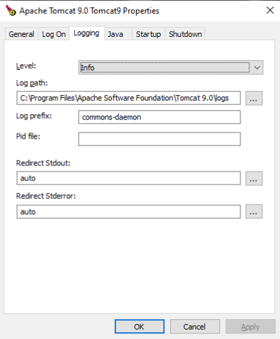

# Installation

--

# Intallationsschritte
- JDK installieren und <span style="color:mediumpurple">JAVA_HOME</style> setzen
- Binärdistribution (https://tomcat.apache.org/download-90.cgi#9.0.96) herunterladen und auspacken, z.B. in ein Verzeichnis <span style="color:mediumpurple"> apache-tomcat-9.0.9</span> <br>
- Die Umgebungsvariable <span style="color:mediumpurple">CATALINA_HOME</span> auf dieses Verzeichnis setzen (erforderlich). Sie zeigt auf den Start-Ordner der Binärdistribution. 
- Das Tomcat Startup-Skript kann diese Variable auch automatisch setzen, wenn sie nicht gesetzt ist.
- Optional: <span style="color:mediumpurple">CATALINA_BASE</span> wird genutzt um die Konfiguration und die Webapps zu trennen und zeigt auf die aktive Konfiguration.

--

# Verzeichnis Struktur

```plaintext
${CATALINA_HOME}
│
├── bin/
│   └── Skripte und Bootstrap
├── conf/
│   ├── catalina.policy
│   ├── catalina.properties
│   ├── context.xml
│   ├── server.xml
│   ├── tomcat-users.xml
│   └── web.xml
├── lib/
│   └── JAR-Dateien
├── logs/
│   ├── catalina.out
│   ├── localhost_access_log.txt
│   └── weitere Logdateien
├── temp/
│   └── temporäre Dateien
├── webapps/
│   ├── docs/
│   ├── examples/
│   ├── host-manager/
│   ├── manager/
│   ├── ROOT/
│   └── weitere Webanwendungen
└── work/
    └── kompilierte JSP-Dateien und temporäre Arbeitsdateien
```
<!-- .element: class="r-stretch" -->


</div>

--

# JDK vs JRE
- Tomcat benötigt <span style="color:mediumpurple">JAVA_HOME</span> für das JDK oder <span style="color:mediumpurple">JRE_HOME</span> für das JRE.
- Ein JDK enthält auch Entwicklungs-Tools, die nicht im JRE enthalten sind.
- JDK ist erforderlich für Entwicklung und wenn JSP benutzt werden
- JRE ist in Produktion ausreichend, wenn JSP vorkompiliert werden.

--

# Umgebungs-Variablen

Das Skript <span style="color: mediumpurple">`bin/setenv`</span> definiert Umgebungsvariablen(außer CATALINA_HOME und CATLINA_BASE):

| JAVA_HOME     | Zeigt auf das Installations-Verzeichnis des JDK. Wird nur für Entwicklung oder JSP benötigt         |
| -- |-----------------------------------------------------------------------------------------------------|
| JRE_HOME      | Zeigt auf die JRE Installation. Muss gesetzt sein wenn JAVA_HOME nicht benutzt wird                 |
| CATALINA_HOME | Zeigt auf das Tomcat Installations-Verzeichnis. Kann vom Start-Skript automatisch ermittelt werden. |
| CATALINA_BASE | Optional: Zeigt auf ein abweichendes Konfigurations-Verzeichnis                                     |
| CATALINA_OPTS | Optional: Java-Optionen für Tomcat, z.B. Memory-Settings                                            |
| JAVA_OPTS     | Optional: Java-Optionen für alle Java-Anwendungen, auch Start- & Stop-Sripte                        |
| CATALINA_PID  | Optional: Nur Unix - Datei mit der Prozess-ID von Tomcat                                            |


--

# Tomcat Starten

Unix:
   
```
    $CATALINA_HOME/bin/startup.sh
    
    oder
    
    $CATALINA_HOME/bin/catalina.sh start
```

<br>
<br>
Windows:

```
    %CATALINA_HOM%\bin\startup.cmd
    
    oder
    
    %CATALINA_HOME%\bin\catalina.cmd start
```

<br>
<br>

Nach dem Start ist Tomcat unter http://localhost:8080 erreichbar.

--

# Tomcat Stoppen

Unix:

    $CATALINA_HOME/bin/shutdown.sh

    oder

    $CATALINA_HOME/bin/catalina.sh stop

<br>
<br>
Windows:

    %CATALINA_HOM%\bin\startup.cmd

    oder

    %CATALINA_HOME%\bin\catalina.cmd stop

--

# Catalina Kommandos
Das Skript `catalina.sh` (oder `catalina.bat`) unterstützt folgende Kommandos:
<br>

| start               | Startet Tomcat im Hintergrund.<br>  Konsolenausgaben werden in die Logdatei<br> `logs/catalina.out` geschrieben. |
| --------------------| -- |
| run                 | Startet Tomcat in der Konsole. <br>Konsolenausgaben werden in der Konsole angezeigt. |
| stop \<n> \<-force> | Stoppt Tomcat.<br>Optional: Wartet n Sekunden.<br>Optional: Mit -force wird SIGKILL benutzt, falls erforderlich.|
| configtest    | Prüft die Konfiguration. |
| version       | Zeigt die Version. |
| debug         | Startet im Debug-Modus im Vordergrund <br>(für Java IDE's mit JPDA Support) |
| jpda start    | Startet Service im Debug-Modus im Hintergrund |

--

# Windows-Service
Windows-Installer (.exe) installiert Tomcat als Windows-Service.<br>
Eigenschaften des Windows-Services über System-Tray.
<div class="r-stack" >





</div>

--


# Linux Installation

  sudo useradd -r -m -U -d /opt/tomcat -s /bin/false tomcat

  curl -O https://downloads.apache.org/tomcat/tomcat-9/v9.0.96/bin/apache-tomcat-9.0.96.tar.gz

  sudo tar xf apache-tomcat-9.0.96.tar.gz  -C /opt/tomcat/

  sudo ln -s /opt/tomcat/apache-tomcat-9.0.96 /opt/tomcat/tomcat9

  sudo chown -R tomcat: /opt/tomcat/*
  sudo sh -c 'chmod +x /opt/tomcat/tomcat9/bin/*.sh'

  sudo vi /etc/systemd/system/tomcat.service

Description=Apache Tomcat
After=network.target

[Service]
Type=forking

Environment="JAVA_HOME=/usr/lib/jvm/java-11-openjdk-amd64"
Environment="CATALINA_PID=/opt/tomcat/tomcat9/temp/tomcat.pid"
Environment="CATALINA_HOME=/opt/tomcat/tomcat9/"
Environment="CATALINA_BASE=/opt/tomcat/tomcat9/"
Environment="CATALINA_OPTS=-Xms512M -Xmx1024M -server -XX:+UseParallelGC"
Environment="JAVA_OPTS=-Djava.awt.headless=true -Djava.security.egd=file:/dev/./urandom"

ExecStart=/opt/tomcat/current/bin/startup.sh
ExecStop=/opt/tomcat/current/bin/shutdown.sh

User=tomcat
Group=tomcat
UMask=0007
RestartSec=10
Restart=always

[Install]
WantedBy=multi-user.target

# 


# 